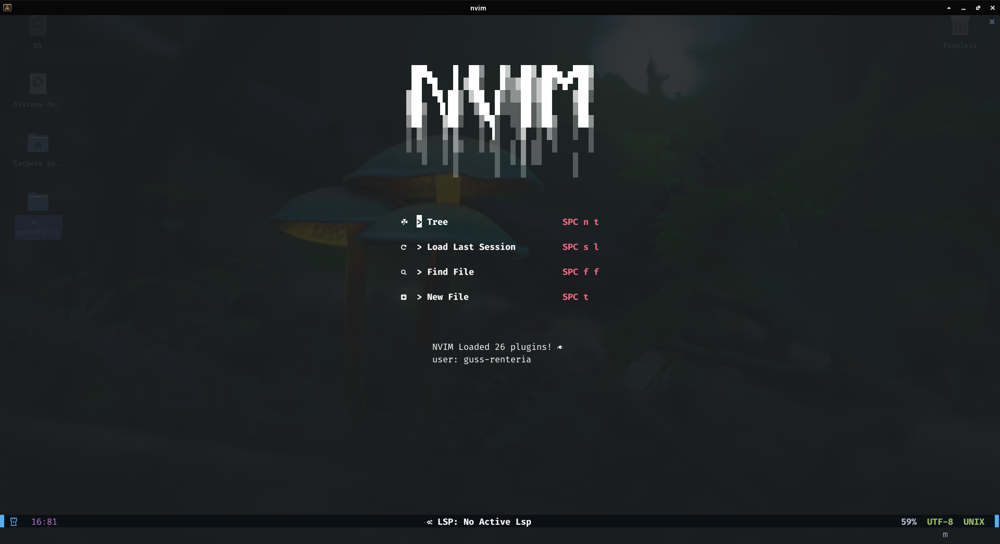

# **NVIM-GUSS**

### **[+] Package manager**

>[Packer](https://github.com/wbthomason/packer.nvim)

---

### **[+] Plugins**

**treesitter**
> [nvim-treesitter/nvim-treesitter](https://github.com/nvim-treesitter/nvim-treesitter)

**nvim-tree**
> [kyazdani42/nvim-tree.lua](https://github.com/kyazdani42/nvim-tree.lua)

**onedark**
> [navarasu/onedark.nvim](https://github.com/navarasu/onedark.nvim)

**web-devicons**
> [kyazdani42/nvim-web-devicons](https://github.com/kyazdani42/nvim-web-devicons)

**dashboard**
> [glepnir/dashboard-nvim](https://github.com/glepnir/dashboard-nvim)

**lualine**
> [nvim-lualine/lualine.nvim](https://github.com/nvim-lualine/lualine.nvim)

**comment**
> [terrortylor/nvim-comment](https://github.com/terrortylor/nvim-comment)

**autopairs**
> [windwp/nvim-autopairs](https://github.com/windwp/nvim-autopairs)

**indentblank-line**
> [lukas-reineke/indent-blankline.nvim](lukas-reineke/indent-blankline.nvim)

**fugitive**
> [tpope/vim-fugitive](https://github.com/tpope/vim-fugitive)

**telescope**
> [nvim-telescope/telescope.nvim](https://github.com/nvim-telescope/telescope.nvim)

**plenary**
> [nvim-lua/plenary.nvim](https://github.com/nvim-lua/plenary.nvim)

**easymotion**
> [easymotion/vim-easymotion](https://github.com/easymotion/vim-easymotion)

**bufferline**
> [akinsho/bufferline.nvim](https://github.com/akinsho/bufferline.nvim)

**Lsp & completion**
> [neovim/nvim-lspconfig](https://github.com/neovim/nvim-lspconfig)

> [L3MON4D3/LuaSnip](https://github.com/L3MON4D3/LuaSnip)

> [hrsh7th/cmp-nvim-lsp](https://github.com/hrsh7th/cmp-nvim-lsp)

> [hrsh7th/cmp-buffer](https://github.com/hrsh7th/cmp-buffer)

> [hrsh7th/cmp-path](https://github.com/hrsh7th/cmp-path)

> [hrsh7th/nvim-cmp](https://github.com/hrsh7th/nvim-cmp)

> [saadparwaiz1/cmp_luasnip](https://github.com/saadparwaiz1/cmp_luasnip)

> [rafamadriz/friendly-snippets](https://github.com/rafamadriz/friendly-snippets)

> 
